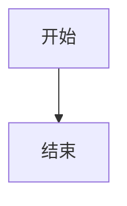
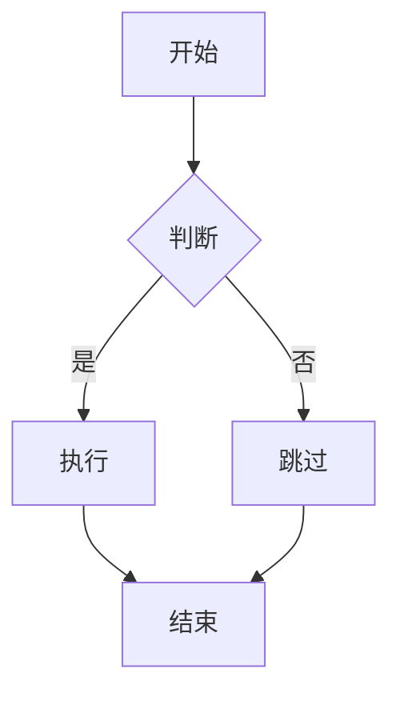

# md2ppt 功能规范白皮书

> 版本：1.0.2
> 日期：2026-03-24
> 用途：测试用例生成与自动化测试参考

---

## 目录

1. [项目概述](#1-项目概述)
2. [系统架构](#2-系统架构)
3. [CLI 工具规范](#3-cli-工具规范)
4. [Web API 规范](#4-web-api-规范)
5. [Markdown 解析规范](#5-markdown-解析规范)
6. [HTML 演示功能规范](#6-html-演示功能规范)
7. [数据模型规范](#7-数据模型规范)
8. [错误处理规范](#8-错误处理规范)
9. [边界条件与特殊情况](#9-边界条件与特殊情况)
10. [测试矩阵](#10-测试矩阵)

---

## 1. 项目概述

**md2ppt** 是一个将 Markdown 文件转换为 PPT 风格 HTML 演示的工具，提供两种使用方式：

- **CLI 模式**：命令行工具，将 `.md` 文件转换为单个 `.html` 演示文件
- **Web 模式**：Flask Web 应用，支持上传、管理、播放多个演示

### 1.1 核心约束

| 约束项 | 规格 |
|--------|------|
| Python 版本 | >= 3.13 |
| 输出格式 | 单个 HTML 演示文件（KaTeX / Mermaid 回退可依赖 CDN） |
| 演示比例 | 16:9 固定比例 |
| 幻灯片分割规则 | 按一级标题（`# `）分割，每个 H1 为一张幻灯片 |
| Web 服务端口 | 5002（默认） |
| Web 默认监听地址 | `127.0.0.1` |
| 数据库 | SQLite（WAL 模式） |
| 文件存储路径 | `data/files/<uuid>/` |

---

## 2. 系统架构

```
md2ppt/
├── main.py              # CLI 入口
├── web_app.py           # Flask Web 应用
├── md2ppt/
│   ├── parser.py        # Markdown 解析器
│   └── generator.py     # HTML 生成器
└── templates/
    └── index.html       # Web 前端
```

### 2.1 数据流

#### CLI 模式
```
.md 文件 → parser.parse_slides() → [HTML 幻灯片列表] → generator.generate_html() → .html 文件
```

#### Web 模式
```
HTTP 上传 → 保存到 data/files/<uuid>/ → 路径重写 → parser → generator → 存 HTML → SQLite 记录
```

---

## 3. CLI 工具规范

### 3.1 命令语法

```
python main.py <input.md> [output.html]
```

### 3.2 参数规范

| 参数 | 类型 | 必填 | 说明 |
|------|------|------|------|
| `input.md` | 文件路径 | 是 | 输入 Markdown 文件，必须存在 |
| `output.html` | 文件路径 | 否 | 输出 HTML 文件路径，默认为与输入同名（扩展名改为 `.html`） |

### 3.3 行为规范

| 场景 | 预期行为 |
|------|---------|
| 仅提供输入文件 `slides.md` | 生成 `slides.html` 到同目录 |
| 提供输入和输出 `a.md b.html` | 生成 `b.html` |
| 输入文件不存在 | 程序退出，返回非零状态码 |
| 输出路径目录不存在 | 程序退出（不自动创建目录） |
| 输入文件为 UTF-8 编码 | 正确读取，含 BOM 也支持 |
| 输入文件为空 | 生成有效的空演示 HTML（0 张幻灯片） |
| 输入文件无 H1 标题 | 生成有效的空演示 HTML（0 张幻灯片） |

### 3.4 演示标题规则

演示 HTML 的 `<title>` 标签内容由以下规则确定：

- 使用**输入文件名**（去除路径和扩展名）作为标题
- 示例：`python main.py /path/to/my-slides.md` → `<title>my-slides</title>`

---

## 4. Web API 规范

Web 服务默认运行在 `http://0.0.0.0:5002`。

### 4.1 GET `/`

**描述**：返回 Web 应用主页面

**响应**：
- 状态码：`200 OK`
- Content-Type：`text/html`
- 内容：完整的 HTML 应用界面

---

### 4.2 GET `/api/presentations`

**描述**：获取所有演示的列表

**响应格式**：
```json
{
  "presentations": [
    {
      "id": "550e8400-e29b-41d4-a716-446655440000",
      "title": "我的演示",
      "filename": "slides.md",
      "resources": ["image1.png", "image2.jpg"],
      "upload_time": "2026-03-24 10:30:00",
      "md_size": 2048,
      "slide_count": 12,
      "status": "ok",
      "error_msg": ""
    }
  ]
}
```

**字段说明**：

| 字段 | 类型 | 说明 |
|------|------|------|
| `id` | string | UUID v4 格式的唯一标识符 |
| `title` | string | 演示标题（来自文件名去扩展名） |
| `filename` | string | 原始 MD 文件名 |
| `resources` | array | 关联的资源文件名列表 |
| `upload_time` | string | 本地时间字符串，格式 `%Y-%m-%d %H:%M:%S` |
| `md_size` | integer | MD 文件大小（字节） |
| `slide_count` | integer | 幻灯片总数 |
| `status` | string | `"ok"` 或 `"error"` |
| `error_msg` | string | 转换错误信息，成功时为空字符串 |

**排序**：按 `upload_time` 降序（最新的在前）

---

### 4.3 GET `/api/check-filename`

**描述**：检查指定文件名是否已存在

**查询参数**：

| 参数 | 类型 | 必填 | 说明 |
|------|------|------|------|
| `filename` | string | 否 | 要检查的 MD 文件名，推荐参数名 |
| `name` | string | 否 | 兼容旧版前端的参数名 |

**响应格式**：
```json
{
  "exists": true,
  "id": "550e8400-e29b-41d4-a716-446655440000",
  "title": "已存在的演示",
  "upload_time": "2026-03-24 10:30:00",
  "latest": {
    "id": "550e8400-e29b-41d4-a716-446655440000",
    "title": "已存在的演示",
    "upload_time": "2026-03-24 10:30:00"
  }
}
```

或文件不存在时：
```json
{
  "exists": false,
  "latest": null
}
```

---

### 4.4 POST `/api/upload`

**描述**：上传 Markdown 文件（及可选资源文件），转换为演示

**请求格式**：`multipart/form-data`

| 字段名 | 类型 | 必填 | 说明 |
|--------|------|------|------|
| `md_file` | file | 是 | Markdown 文件（`.md` 扩展名） |
| `resources` | file[] | 否 | 资源文件（图片等），可多个 |
| `overwrite_id` | string | 否 | 若提供，覆盖该 UUID 对应的演示 |

**成功响应**（状态码 200）：
```json
{
  "ok": true,
  "id": "550e8400-e29b-41d4-a716-446655440000",
  "title": "演示标题",
  "slide_count": 12,
  "status": "ok",
  "error": null
}
```

**转换错误响应**（状态码 200，业务错误）：
```json
{
  "ok": false,
  "id": "550e8400-e29b-41d4-a716-446655440000",
  "title": "演示标题",
  "slide_count": 0,
  "status": "error",
  "error": "具体错误信息"
}
```

**HTTP 错误响应**（如缺少 md_file）：
```json
{
  "ok": false,
  "error": "错误描述"
}
```

**上传处理流程**：
1. 验证 `md_file` 存在
2. 生成新 UUID（或使用 `overwrite_id`）
3. 创建目录 `data/files/<uuid>/`
4. 保存 MD 文件和资源文件
5. 校验资源文件 basename 唯一，且不能与 Markdown 文件同名
6. 保持 HTML 中的资源引用为 basename，并通过 `/play/<uuid>` 注入 `<base>` 解析
7. 执行 Markdown 解析和 HTML 生成
8. 保存生成的 `presentation.html`
9. 写入 SQLite 数据库记录

**资源路径规则**：
- 上传资源存储在 `data/files/<uuid>/` 的平铺目录中
- HTML 中相对资源引用会按 basename 重写
- 因此资源文件 basename 必须唯一；不支持同一演示中两个不同目录下的同名资源
- 播放页面会注入 `<base href="../files/{uuid}/">`，确保资源正确解析

---

### 4.5 POST `/api/presentations/<id>/regenerate`

**描述**：重新生成指定演示的 HTML（保留原 MD 文件和资源）

**路径参数**：

| 参数 | 说明 |
|------|------|
| `id` | 演示的 UUID |

**成功响应**：
```json
{
  "ok": true,
  "slide_count": 12,
  "error": null
}
```

**演示不存在响应**：
```json
{
  "ok": false,
  "error": "Not found"
}
```

---

### 4.6 DELETE `/api/presentations/<id>`

**描述**：删除演示及其所有关联文件

**路径参数**：

| 参数 | 说明 |
|------|------|
| `id` | 演示的 UUID |

**成功响应**：
```json
{
  "ok": true
}
```

**删除行为**：
- 从 SQLite 删除记录
- 删除整个 `data/files/<uuid>/` 目录（含所有文件）
- 即使文件不存在也返回成功

---

### 4.7 GET `/play/<id>`

**描述**：播放（查看）指定演示

**路径参数**：

| 参数 | 说明 |
|------|------|
| `id` | 演示的 UUID |

**成功响应**：
- 状态码：`200 OK`
- Content-Type：`text/html`
- 内容：完整的演示 HTML 文件，包含 `<base href>` 标签

**演示不存在或转换失败**：
- 状态码：`404 Not Found` 或显示错误页面

---

### 4.8 GET `/files/<id>/<filename>`

**描述**：访问演示关联的资源文件

**路径参数**：

| 参数 | 说明 |
|------|------|
| `id` | 演示的 UUID |
| `filename` | 资源文件名 |

**响应**：
- 状态码：`200 OK`
- Content-Type：根据文件类型自动判断（`image/jpeg`, `image/png` 等）
- 内容：文件二进制内容

---

### 4.9 GET `/example.md`

**描述**：下载示例 Markdown 文件

**响应**：
- Content-Type：`text/plain`
- Content-Disposition：`attachment; filename=example.md`

---

## 5. Markdown 解析规范

### 5.1 幻灯片分割规则

**核心规则**：Markdown 文档按一级标题（`# 标题`）分割为幻灯片。

| 规则 | 说明 |
|------|------|
| 每个 `# 标题` 开始一张新幻灯片 | H1 及其后续内容（直到下一个 H1 或文档末尾）构成一张幻灯片 |
| 第一个 H1 之前的内容被丢弃 | 文档开头（前置 front matter 等）不生成幻灯片 |
| 代码块内的 `#` 不触发分割 | ` ``` ` 和 `~~~` 代码栅栏内的内容被完整保留 |
| 空文档或无 H1 文档 | 返回空列表（0 张幻灯片） |

**示例**：
```markdown
前置内容（被丢弃）

# 第一张幻灯片        ← 触发分割
内容 A

## 子标题             ← 不触发分割，属于第一张
内容 B

# 第二张幻灯片        ← 触发分割
内容 C
```
→ 生成 2 张幻灯片

### 5.2 支持的 Markdown 元素

#### 5.2.1 标准元素

| 元素 | 输入语法 | 输出 HTML 标签 |
|------|---------|--------------|
| 一级标题 | `# 标题` | `<h1>` |
| 二级标题 | `## 标题` | `<h2>` |
| 三级标题 | `### 标题` | `<h3>` |
| 粗体 | `**文字**` | `<strong>` |
| 斜体 | `*文字*` | `<em>` |
| 删除线 | `~~文字~~` | `<del>` |
| 高亮 | `==文字==` | `<mark>` |
| 行内代码 | `` `代码` `` | `<code>` |
| 链接 | `[文字](url)` | `<a href="url">` |
| 图片 | `` | `` |
| 引用块 | `> 文字` | `<blockquote>` |
| 无序列表 | `- item` | `<ul><li>` |
| 有序列表 | `1. item` | `<ol><li>` |
| 水平线 | `---` | `<hr>` |
| 段落 | 普通文本 | `<p>` |
| 表格 | GFM 表格语法 | `<table>` |

#### 5.2.2 任务清单

```markdown
- [ ] 未完成任务
- [x] 已完成任务
```

**输出**：带有视觉勾选框的列表项
- 未完成：空心方框样式
- 已完成：勾选方框样式，文字带删除线效果

#### 5.2.3 代码块与语法高亮

````markdown
```python
def hello():
    print("Hello World")
```
````

**规则**：
- 使用 Pygments 进行语法高亮
- 支持所有 Pygments 支持的语言标识符
- 未知语言标识符：输出无高亮的代码块
- 无语言标识符：输出纯文本代码块
- 使用主题：优先 `one-dark`，fallback `monokai` → `dracula` → `native`

#### 5.2.4 Mermaid 图表

````markdown

````

**规则**：
- 生成 `<div class="mermaid">` 容器，内含原始 Mermaid 代码
- 由浏览器端 Mermaid.js（CDN）渲染
- 窗口调整大小时自动重新渲染

支持的图表类型（由 Mermaid.js 决定）：
- `graph` / `flowchart`（流程图）
- `sequenceDiagram`（时序图）
- `classDiagram`（类图）
- `stateDiagram`（状态图）
- `erDiagram`（ER 图）
- `gantt`（甘特图）
- `pie`（饼图）

#### 5.2.5 数学公式（LaTeX/KaTeX）

| 类型 | 语法 | 渲染方式 |
|------|------|---------|
| 行内公式 | `$E=mc^2$` | 行内 KaTeX 渲染 |
| 块级公式 | `$$\int_0^1 x dx$$` | 独立居中 KaTeX 渲染 |

**规则**：
- 解析时将公式内容提取，生成 `<span class="math-inline" data-math="...">` 或 `<div class="math-display" data-math="...">`
- HTML 特殊字符在 `data-math` 属性中被 HTML 编码
- 由浏览器端 KaTeX（CDN）渲染

#### 5.2.6 Callout 块

```markdown
> [!NOTE]
> 这是一个注意事项

> [!WARNING] 自定义标题
> 这是警告内容
```

**格式**：
```
> [!TYPE]
> 内容行1
> 内容行2
```

或带自定义标题：
```
> [!TYPE] 自定义标题文字
> 内容
```

**支持的 22 种 Callout 类型**：

| 类型关键字 | 图标 | 主色 | 背景色 |
|-----------|------|------|--------|
| `note` | ℹ️ | #3b82f6（蓝） | #eff6ff |
| `info` | ℹ️ | #3b82f6（蓝） | #eff6ff |
| `tip` | 💡 | #10b981（绿） | #f0fdf4 |
| `hint` | 💡 | #10b981（绿） | #f0fdf4 |
| `important` | ❗ | #8b5cf6（紫） | #f5f3ff |
| `warning` | ⚠️ | #f59e0b（橙） | #fffbeb |
| `caution` | ⚠️ | #f59e0b（橙） | #fffbeb |
| `attention` | ⚠️ | #f59e0b（橙） | #fffbeb |
| `danger` | 🚨 | #ef4444（红） | #fef2f2 |
| `error` | 🚨 | #ef4444（红） | #fef2f2 |
| `bug` | 🐛 | #ef4444（红） | #fef2f2 |
| `success` | ✅ | #10b981（绿） | #f0fdf4 |
| `check` | ✅ | #10b981（绿） | #f0fdf4 |
| `done` | ✅ | #10b981（绿） | #f0fdf4 |
| `question` | ❓ | #6366f1（靛） | #eef2ff |
| `help` | ❓ | #6366f1（靛） | #eef2ff |
| `faq` | ❓ | #6366f1（靛） | #eef2ff |
| `quote` | 💬 | #64748b（灰） | #f8fafc |
| `cite` | 💬 | #64748b（灰） | #f8fafc |
| `abstract` | 📋 | #0ea5e9（天蓝）| #f0f9ff |
| `summary` | 📋 | #0ea5e9（天蓝）| #f0f9ff |
| `example` | 🔖 | #ec4899（粉） | #fdf4ff |

**Callout 输出 HTML 结构**：
```html
<div class="callout" style="--callout-color: #3b82f6; --callout-bg: #eff6ff;">
  <div class="callout-title">
    <span class="callout-icon">ℹ️</span>
    标题文字（默认为类型名的首字母大写）
  </div>
  <div class="callout-body">
    <p>内容</p>
  </div>
</div>
```

**类型匹配**：不区分大小写（`NOTE` = `note` = `Note`）

#### 5.2.7 Obsidian 图片语法

```markdown
![[文件名.png]]
![[路径/图片.jpg]]
```

**规则**：
- 转换为标准 Markdown 图片语法 ``
- 仅处理文件名部分（去掉路径前缀，仅保留最后的文件名）
- 在标准 Markdown 渲染前预处理

---

## 6. HTML 演示功能规范

### 6.1 幻灯片布局

#### 6.1.1 第一张幻灯片（封面）

- CSS 类：`.slide-title`
- H1 标题居中显示
- 内容垂直居中于幻灯片

#### 6.1.2 其他幻灯片

HTML 结构：
```html
<div class="slide" id="slide-N">
  <div class="slide-header">
    <h1>幻灯片标题</h1>
  </div>
  <div class="slide-inner">
    <!-- 可滚动内容区 -->
  </div>
</div>
```

- `.slide-header`：固定在幻灯片顶部，不随内容滚动
- `.slide-inner`：可垂直滚动，当内容超出幻灯片高度时

#### 6.1.3 图片布局

| 情形 | 布局 |
|------|------|
| 段落中只有 1 张图片 | 居中显示 |
| 段落中有 2 张图片 | 并排显示，各占 50% |
| 段落中有 3+ 张图片 | 并排显示，平均分配宽度 |

**检测规则**：通过 CSS `:has()` 选择器：`p:has(img):not(:has(*:not(img)))` 识别"仅含图片的段落"

### 6.2 键盘快捷键

| 按键 | 功能 |
|------|------|
| `→` | 下一张幻灯片 |
| `PageDown` | 下一张幻灯片 |
| `Space` | 下一张幻灯片 |
| `←` | 上一张幻灯片 |
| `PageUp` | 上一张幻灯片 |
| `Home` | 跳到第一张幻灯片 |
| `End` | 跳到最后一张幻灯片 |
| `0`-`9` | 跳到第 N 张幻灯片（`0` = 第 10 张，若存在） |
| `F` | 切换全屏 |
| `M` | 切换深色/浅色模式 |
| `C` | 显示/隐藏目录（TOC） |
| `T` | 启动计时器 |
| `P` | 暂停/继续计时器 |
| `R` | 重置计时器 |
| `Esc` | 关闭目录 / 退出全屏 |

### 6.3 幻灯片导航

**切换动画**：
- 方向感知：向前切换从右侧进入，向后切换从左侧进入
- 过渡效果：`transform: translateX()` + cubic-bezier 缓动
- 过渡时长：420ms

**计数器**：
- 格式：`当前张 / 总张数`（从 1 开始计数）
- 位置：幻灯片右下角

**进度条**：
- 位于幻灯片底部的细长条
- 宽度随当前进度动态更新

### 6.4 目录（TOC）

**触发方式**：点击 "☰ 目录" 按钮 或 按 `C` 键

**内容**：提取每张幻灯片的 H1 文本，生成可点击列表

**格式**：
```
1. 第一张幻灯片标题
2. 第二张幻灯片标题
   ← （当前幻灯片高亮）
3. 第三张幻灯片标题
```

**交互**：点击任意条目跳转到对应幻灯片，TOC 自动关闭

### 6.5 深色模式

**切换方式**：点击 "🌙 深色" 按钮 或 按 `M` 键

**持久化**：使用 `localStorage` 保存偏好，刷新后保持

**视觉变化**：
- 背景色变为深色
- 文字颜色变为浅色
- 代码块保持深色背景（不变）
- 表格、引用等元素颜色适配

### 6.6 全屏模式

**触发方式**：点击 "⛶ 全屏" 按钮 或 按 `F` 键

**行为**：
- 调用浏览器原生全屏 API
- 全屏时光标在 3 秒无活动后自动隐藏
- 鼠标移动恢复显示光标
- `Esc` 键退出全屏

### 6.7 计时器

**触发方式**：点击 "⏱ 计时" 按钮 或 按 `T` 键启动

**状态机**：
```
[停止] →(T)→ [运行] →(P)→ [暂停] →(P)→ [运行]
  ↑                              |
  └──────────(R)─────────────────┘
```

**显示格式**：
- 小于 1 小时：`MM:SS`
- 大于等于 1 小时：`HH:MM:SS`

### 6.8 会话恢复

**机制**：使用 `sessionStorage` 保存当前幻灯片索引

**行为**：
- 刷新页面后自动跳转到上次停留的幻灯片
- 关闭标签页后不保留（sessionStorage 特性）
- 键名：`'slide'`

### 6.9 外部库加载

HTML 从 CDN 加载以下库（生产 HTML 依赖网络访问）：

| 库 | 用途 | 加载方式 |
|----|------|---------|
| KaTeX CSS | 数学公式样式 | `<link>` |
| KaTeX JS | 数学公式渲染 | `<script>` |
| Mermaid.js | 图表渲染 | `<script>` |

**离线场景**：若 CDN 不可用，数学公式显示为原始文本，Mermaid 图表不渲染。

---

## 7. 数据模型规范

### 7.1 SQLite 数据库

**位置**：`data/presentations.db`
**模式**：WAL（Write-Ahead Logging）

**表结构**：

```sql
CREATE TABLE presentations (
    id          TEXT PRIMARY KEY,    -- UUID v4
    title       TEXT NOT NULL,       -- 演示标题
    filename    TEXT NOT NULL,       -- 原始 MD 文件名
    resources   TEXT DEFAULT '',     -- 逗号分隔的资源文件名列表
    upload_time TEXT NOT NULL,       -- ISO 8601 格式
    md_size     INTEGER DEFAULT 0,   -- MD 文件大小（字节）
    slide_count INTEGER DEFAULT 0,   -- 幻灯片数量
    status      TEXT DEFAULT 'ok',   -- 'ok' 或 'error'
    error_msg   TEXT DEFAULT ''      -- 错误信息
);
```

### 7.2 文件系统结构

```
data/
└── files/
    └── <uuid>/                      # 每个演示一个目录
        ├── <original-filename>.md   # 原始 MD 文件（经过路径重写）
        ├── presentation.html        # 生成的演示 HTML
        ├── image1.png               # 上传的资源文件（可选）
        └── photo.jpg                # 上传的资源文件（可选）
```

**命名规则**：
- 目录名：UUID v4 格式（`xxxxxxxx-xxxx-4xxx-yxxx-xxxxxxxxxxxx`）
- MD 文件：保留原始文件名
- 生成 HTML：固定名称 `presentation.html`
- 资源文件：保留原始文件名

---

## 8. 错误处理规范

### 8.1 API 错误响应格式

所有 API 错误统一返回：
```json
{
  "ok": false,
  "error": "人类可读的错误描述"
}
```

### 8.2 HTTP 状态码

| 场景 | 状态码 |
|------|--------|
| 成功操作 | 200 |
| 资源不存在（演示、文件） | 404 |
| 缺少必要参数 | 400 |
| 服务器内部错误 | 500 |

### 8.3 业务错误（状态码 200）

以下情况 HTTP 状态码为 200，但业务字段表示错误：

- 上传成功但转换失败：`{"ok": true, "status": "error", "error": "错误详情"}`
- 重新生成失败：`{"ok": true, "error": "错误详情"}`

### 8.4 CLI 错误处理

| 错误类型 | 行为 |
|---------|------|
| 缺少必要参数 | 打印用法说明，退出码 1 |
| 输入文件不存在 | 打印错误信息，退出码 1 |
| 读取文件失败 | 打印错误信息，退出码 1 |

---

## 9. 边界条件与特殊情况

### 9.1 Markdown 解析边界条件

| 场景 | 预期行为 |
|------|---------|
| 空字符串输入 | 返回空列表 `[]` |
| 只有前置内容，无 H1 | 返回空列表 `[]` |
| 连续多个 H1 | 每个 H1 生成一张幻灯片（可能有空幻灯片） |
| H1 后紧跟另一 H1 | 第一张幻灯片只有标题，无内容 |
| 代码块内的 `# 标题` | 不触发幻灯片分割，作为代码内容 |
| `~~~` 代码栅栏 | 与 ` ``` ` 等效处理 |
| 未闭合的代码栅栏 | 后续所有内容视为代码块内容 |
| 嵌套数学公式 | `$...$` 内的 `$$` 不触发块级公式 |
| Callout 类型不存在 | 使用默认样式（灰色，无图标） |
| 图片路径含空格 | 正常处理（URL 编码） |
| 极长单词/URL | 可能溢出幻灯片边界（由 CSS `word-break` 处理） |

### 9.2 Web 应用边界条件

| 场景 | 预期行为 |
|------|---------|
| 上传非 MD 文件 | 返回错误 |
| 上传空 MD 文件 | 生成演示，`slide_count = 0` |
| 上传超大文件 | 由 Flask 默认限制处理（16MB） |
| 同名文件重复上传 | 通过 `overwrite_id` 机制处理 |
| 删除不存在的演示 | 返回成功（幂等操作） |
| 访问不存在的资源文件 | 返回 404 |
| 数据库文件不存在 | 启动时自动创建 |

### 9.3 演示交互边界条件

| 场景 | 预期行为 |
|------|---------|
| 在第一张幻灯片按"上一张" | 无操作（不循环） |
| 在最后一张幻灯片按"下一张" | 无操作（不循环） |
| 数字键超过总幻灯片数 | 无操作 |
| 计时器未启动时按暂停 | 无操作 |
| 0 张幻灯片的演示 | 显示空白页面，计数器显示"0 / 0" |
| 1 张幻灯片的演示 | 不显示导航按钮或禁用导航 |
| 在全屏中按 Esc | 先退出全屏，不关闭 TOC |

---

## 10. 测试矩阵

### 10.1 CLI 功能测试

| 测试 ID | 测试描述 | 输入 | 预期输出 |
|---------|---------|------|---------|
| CLI-001 | 基本转换 | `main.py simple.md` | 生成 `simple.html`，退出码 0 |
| CLI-002 | 指定输出文件 | `main.py a.md b.html` | 生成 `b.html`，退出码 0 |
| CLI-003 | 文件不存在 | `main.py nonexistent.md` | 退出码非 0，错误信息 |
| CLI-004 | 无参数 | `main.py` | 退出码非 0，显示用法 |
| CLI-005 | 标题提取 | `main.py my-presentation.md` | HTML `<title>` 为 `my-presentation` |
| CLI-006 | 中文 Markdown | 含中文的 .md 文件 | 正确输出中文内容 |
| CLI-007 | 空文件 | 空的 .md 文件 | 生成有效 HTML，`slide_count = 0` |

### 10.2 Markdown 解析测试

| 测试 ID | 测试描述 | 输入 Markdown | 预期 HTML |
|---------|---------|--------------|---------|
| MD-001 | H1 分割 | `# A\n...\n# B\n...` | 2 张幻灯片 |
| MD-002 | 代码块内 H1 不分割 | ` ```\n# fake\n``` ` | 1 张幻灯片 |
| MD-003 | 粗体 | `**bold**` | `<strong>bold</strong>` |
| MD-004 | 斜体 | `*italic*` | `<em>italic</em>` |
| MD-005 | 删除线 | `~~del~~` | `<del>del</del>` |
| MD-006 | 高亮 | `==mark==` | `<mark>mark</mark>` |
| MD-007 | 行内代码 | `` `code` `` | `<code>code</code>` |
| MD-008 | 任务清单未完成 | `- [ ] task` | 含 checkbox 的 li，未勾选样式 |
| MD-009 | 任务清单已完成 | `- [x] task` | 含 checkbox 的 li，已勾选样式 |
| MD-010 | 表格 | GFM 表格 | `<table>` 结构正确 |
| MD-011 | 行内数学 | `$E=mc^2$` | `<span class="math-inline" data-math="...">` |
| MD-012 | 块级数学 | `$$\int...$$` | `<div class="math-display" data-math="...">` |
| MD-013 | Mermaid 图表 | ` ```mermaid\ngraph TD... ``` ` | `<div class="mermaid">` |
| MD-014 | Callout NOTE | `> [!NOTE]\n> 内容` | `<div class="callout">` 含蓝色样式 |
| MD-015 | Callout WARNING | `> [!WARNING]\n> 内容` | `<div class="callout">` 含橙色样式 |
| MD-016 | Callout 自定义标题 | `> [!NOTE] 自定义\n> 内容` | 标题显示"自定义" |
| MD-017 | Callout 大写类型 | `> [!NOTE]` 等价于 `> [!note]` | 相同渲染结果 |
| MD-018 | Obsidian 图片 | `![[image.png]]` | `` |
| MD-019 | 嵌套列表 | 多级 `- item\n  - sub` | 正确嵌套的 `<ul>` |
| MD-020 | 代码语法高亮 | ` ```python\ncode``` ` | 含 Pygments CSS 类的高亮 HTML |
| MD-021 | 未知代码语言 | ` ```xyz\ncode``` ` | 无高亮的代码块 |
| MD-022 | 图片并排（2张） | `` 在同一段落 | 两图并排布局 |
| MD-023 | 前置内容丢弃 | `前置内容\n# 标题` | 只有 1 张幻灯片，不含前置内容 |

### 10.3 Web API 测试

| 测试 ID | 测试描述 | 请求 | 预期响应 |
|---------|---------|------|---------|
| API-001 | 获取演示列表（空） | `GET /api/presentations` | `{"presentations": []}` |
| API-002 | 上传演示 | `POST /api/upload` + md_file | `{"ok": true, "id": "...", "slide_count": N}` |
| API-003 | 上传后列表包含新记录 | 上传后 `GET /api/presentations` | 列表含新演示 |
| API-004 | 检查文件名（不存在） | `GET /api/check-filename?filename=new.md` | `{"exists": false}` |
| API-005 | 检查文件名（已存在） | 上传后检查同名 | `{"exists": true, "id": "..."}` |
| API-006 | 播放演示 | `GET /play/<id>` | 200，HTML 内容 |
| API-007 | 播放不存在演示 | `GET /play/invalid-id` | 404 |
| API-008 | 删除演示 | `DELETE /api/presentations/<id>` | `{"ok": true}` |
| API-009 | 删除后列表不含该记录 | 删除后 `GET /api/presentations` | 列表不含已删除演示 |
| API-010 | 重新生成演示 | `POST /api/presentations/<id>/regenerate` | `{"ok": true, "slide_count": N}` |
| API-011 | 重新生成不存在演示 | `POST /api/presentations/invalid/regenerate` | `{"ok": false, "error": "Not found"}` |
| API-012 | 上传带资源文件 | `POST /api/upload` + md_file + resources | 资源文件可通过 `/files/<id>/<filename>` 访问 |
| API-013 | 访问资源文件 | `GET /files/<id>/image.png` | 200，图片二进制数据 |
| API-014 | 访问不存在资源 | `GET /files/<id>/nonexist.png` | 404 |
| API-015 | 上传无 md_file | `POST /api/upload` 无文件字段 | `{"ok": false, "error": "..."}` |
| API-016 | 覆盖已有演示 | `POST /api/upload` + `overwrite_id=<id>` | 同一 ID，内容更新 |
| API-017 | 下载示例 MD | `GET /example.md` | 200，Content-Disposition: attachment |
| API-018 | 上传转换失败的 MD | 含非法内容的 MD | `{"ok": true, "status": "error"}` |
| API-019 | 演示记录字段完整性 | `GET /api/presentations` | 所有字段存在且类型正确 |
| API-020 | 演示按时间降序 | 多次上传后列表 | 最新的在最前 |

### 10.4 HTML 演示交互测试

| 测试 ID | 测试描述 | 操作 | 预期结果 |
|---------|---------|------|---------|
| PPT-001 | 初始状态 | 打开演示 | 显示第 1 张幻灯片，计数器 "1 / N" |
| PPT-002 | 向右导航 | 按 `→` | 显示第 2 张 |
| PPT-003 | 向左导航 | 在第 2 张按 `←` | 返回第 1 张 |
| PPT-004 | 首页边界 | 在第 1 张按 `←` | 无变化，仍第 1 张 |
| PPT-005 | 末页边界 | 在最后一张按 `→` | 无变化 |
| PPT-006 | Space 导航 | 按 `Space` | 下一张 |
| PPT-007 | Home 键 | 在任意张按 `Home` | 跳到第 1 张 |
| PPT-008 | End 键 | 在任意张按 `End` | 跳到最后一张 |
| PPT-009 | 数字键跳转 | 按 `3` | 跳到第 3 张 |
| PPT-010 | 深色模式 | 按 `M` | 界面变为深色 |
| PPT-011 | 深色模式持久化 | 启用深色后刷新 | 仍为深色模式 |
| PPT-012 | 全屏模式 | 按 `F` | 进入全屏 |
| PPT-013 | 退出全屏 | 全屏中按 `Esc` | 退出全屏 |
| PPT-014 | TOC 显示 | 按 `C` | TOC 面板出现，列出所有幻灯片标题 |
| PPT-015 | TOC 跳转 | 在 TOC 中点击第 3 项 | 跳到第 3 张，TOC 关闭 |
| PPT-016 | 关闭 TOC | TOC 打开时按 `Esc` | TOC 关闭 |
| PPT-017 | 计时器启动 | 按 `T` | 计时器从 00:00 开始计时 |
| PPT-018 | 计时器暂停 | 运行中按 `P` | 计时停止 |
| PPT-019 | 计时器恢复 | 暂停后按 `P` | 计时继续 |
| PPT-020 | 计时器重置 | 运行中按 `R` | 计时器归零并停止 |
| PPT-021 | 会话恢复 | 在第 3 张时刷新 | 刷新后仍在第 3 张 |
| PPT-022 | 进度条更新 | 翻页 | 进度条宽度随当前进度变化 |
| PPT-023 | 切换动画 | 翻页 | 有平滑的横向滑动动画 |
| PPT-024 | 当前幻灯片高亮 | TOC 打开 | 当前幻灯片在 TOC 中高亮 |
| PPT-025 | KaTeX 渲染 | 含数学公式的幻灯片 | 公式正确渲染（需网络） |
| PPT-026 | Mermaid 渲染 | 含 Mermaid 图的幻灯片 | 图表正确渲染（需网络） |

### 10.5 边界与负面测试

| 测试 ID | 测试描述 | 输入 | 预期结果 |
|---------|---------|------|---------|
| NEG-001 | 空 MD 文件上传 | 空文件 | 成功上传，`slide_count = 0` |
| NEG-002 | 无 H1 的 MD | 只有 H2 的 MD | 成功上传，`slide_count = 0` |
| NEG-003 | 超大 MD 文件 | > 16MB 的文件 | 返回合适错误 |
| NEG-004 | 特殊字符文件名 | `my file (1).md` | 正确处理（空格、括号） |
| NEG-005 | Unicode 文件名 | `中文文件名.md` | 正确保存和显示 |
| NEG-006 | 只有一张幻灯片 | 只有一个 H1 的 MD | 正常渲染，导航键无效果 |
| NEG-007 | 未闭合代码栅栏 | ` ```\n代码内容（无闭合）` | 不崩溃，内容作为代码处理 |
| NEG-008 | 嵌套 Callout | Callout 内嵌 Callout | 外层 Callout 正常渲染 |
| NEG-009 | 无效 Callout 类型 | `> [!INVALID]` | 使用默认样式渲染 |
| NEG-010 | 删除不存在 ID | `DELETE /api/presentations/nonexist` | `{"ok": true}` |
| NEG-011 | 无效 UUID 格式 | `GET /play/not-a-uuid` | 404 |

---

## 附录 A：示例 Markdown 文件

一个完整的测试用 Markdown 文件应包含以下元素：

```markdown
# 封面幻灯片

副标题文字

---

# 文字格式测试

**粗体** *斜体* ~~删除线~~ ==高亮== `行内代码`

---

# 列表测试

- 无序列表项 1
  - 嵌套项 1.1
  - 嵌套项 1.2
- 无序列表项 2

1. 有序列表项 1
2. 有序列表项 2

---

# 任务清单

- [x] 已完成任务
- [ ] 未完成任务

---

# 代码高亮

```python
def hello(name: str) -> str:
    return f"Hello, {name}!"
```

---

# 表格

| 列1 | 列2 | 列3 |
|-----|-----|-----|
| A   | B   | C   |
| D   | E   | F   |

---

# 数学公式

行内公式：$E = mc^2$

块级公式：

$$\int_0^1 x^2 dx = \frac{1}{3}$$

---

# Mermaid 图表



---

# Callout 块

> [!NOTE]
> 这是一个注意事项

> [!WARNING] 重要警告
> 请注意这个警告信息

> [!SUCCESS]
> 操作成功完成

---

# 图片测试


---

# 多图并排


```

---

## 附录 B：自动化测试建议

### B.1 单元测试推荐

- **解析器测试**：针对 `md2ppt/parser.py` 的各个函数，使用固定输入验证输出 HTML
- **生成器测试**：针对 `md2ppt/generator.py`，验证生成 HTML 的结构完整性
- **幻灯片计数验证**：验证不同 MD 输入对应正确的幻灯片数量

### B.2 API 测试推荐

- 使用 `pytest` + `requests` 或 Flask 测试客户端
- 每个测试用例应独立（使用 setUp/tearDown 清理数据库和文件）
- 文件上传测试使用 `io.BytesIO` 模拟文件对象

### B.3 E2E 测试推荐

- 使用 Playwright 或 Selenium 进行浏览器自动化测试
- 验证键盘快捷键行为需要模拟键盘事件
- 全屏测试需要处理浏览器全屏 API 权限

### B.4 测试环境配置

```python
# 推荐的测试配置
import pytest
import os
import tempfile

@pytest.fixture
def app():
    """创建使用临时目录的测试 Flask 应用"""
    from web_app import app, init_db

    with tempfile.TemporaryDirectory() as tmpdir:
        app.config['TESTING'] = True
        app.config['DATA_DIR'] = tmpdir
        init_db(os.path.join(tmpdir, 'test.db'))
        yield app
```

---

*本文档描述的所有行为基于 md2ppt v0.1.0 的实现。如实现发生变更，请同步更新本文档。*
