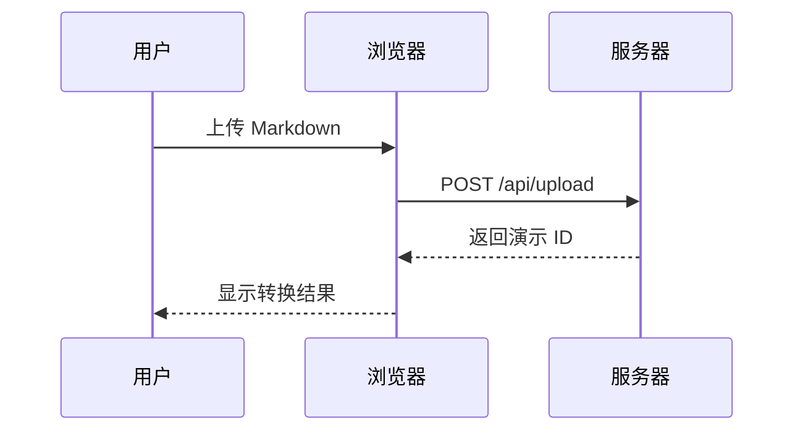

# md2ppt 演示

将 Markdown 文件一键转换为网页版 PPT

> 简洁、优雅、开箱即用。支持数学公式、流程图、Callout、深色模式等功能。

# Markdown 格式规范

## 幻灯片结构

- 每个 `# 一级标题` 对应**一张新幻灯片**
- 第一个 `#` 自动渲染为居中**封面页**
- `##` / `###` 为页内小标题，不新建幻灯片

## 文字样式

支持全部标准 Markdown 行内语法：**粗体**、*斜体*、~~删除线~~、`行内代码`、[链接](#)

==高亮文字== 使用双等号包裹（Obsidian 兼容语法）。

> 引用块：蓝色左边框，适合标注重点或引用语句。

# 列表与任务清单

## 无序 / 有序列表

- 第一项
- 第二项
  - 嵌套列表
  - 支持多层缩进
- 第三项

1. 有序列表
2. 自动编号
3. 同样支持嵌套

## 任务清单

- [x] 支持 Markdown 标准语法
- [x] 语法高亮代码块
- [x] LaTeX 数学公式
- [x] Mermaid 流程图
- [ ] 更多主题风格（规划中）

# 代码块

## Python

```python
def parse_slides(md_text: str) -> list[str]:
    """按一级标题拆分 Markdown 为幻灯片列表"""
    raw_slides = _split_by_h1(md_text)
    md = mistune.create_markdown(
        renderer=_HighlightRenderer(escape=False),
        plugins=['table', 'strikethrough', 'task_lists', 'mark'],
    )
    return [md(slide) for slide in raw_slides]
```

## Bash

```bash
# 命令行用法
uv run python main.py slides.md            # 输出 slides.html
uv run python main.py slides.md out.html   # 指定输出路径
```

# 数学公式

## 行内公式

勾股定理：$a^2 + b^2 = c^2$，欧拉公式：$e^{i\pi} + 1 = 0$

## 块级公式

求根公式：

$$x = \frac{-b \pm \sqrt{b^2 - 4ac}}{2a}$$

正态分布概率密度函数：

$$f(x) = \frac{1}{\sigma\sqrt{2\pi}} e^{-\frac{(x-\mu)^2}{2\sigma^2}}$$

# Mermaid 流程图

## 流程图


```mermaid
graph LR
    A[上传 .md 文件] --> B[解析幻灯片]
    B --> C[渲染 HTML]
    C --> D[保存到服务器]
    D --> E[在浏览器中播放]
```

## 时序图


```mermaid
sequenceDiagram
    participant 用户
    participant 浏览器
    participant 服务器
    用户->>浏览器: 上传 Markdown
    浏览器->>服务器: POST /api/upload
    服务器-->>浏览器: 返回演示 ID
    浏览器-->>用户: 显示转换结果
```

# SVG 图片

<svg viewBox="0 0 680 560" width="100%" role="img" aria-label="Notion 工作区现状结构图">
  <title>Notion 工作区现状结构图</title>
  <desc>展示当前 10 个顶层项目及其数据量、问题标注</desc>
  <defs>
    <marker id="arrow" viewBox="0 0 10 10" refX="8" refY="5"
      markerWidth="6" markerHeight="6" orient="auto-start-reverse">
      <path d="M2 1L8 5L2 9" fill="none" stroke="context-stroke"
        stroke-width="1.5" stroke-linecap="round" stroke-linejoin="round"/>
    </marker>
  </defs>

  <!-- Title -->
  <text x="340" y="28" text-anchor="middle" style="font-family: var(--font-sans); font-size: 14px; font-weight: 500; fill: #444441;">当前工作区结构（10 个顶层项目，无主页/Dashboard）</text>

  <!-- Work zone container -->
  <rect x="30" y="50" width="300" height="480" rx="16" fill="#E6F1FB" stroke="#85B7EB" stroke-width="0.5"/>
  <text x="180" y="72" text-anchor="middle" style="font-family: var(--font-sans); font-size: 13px; font-weight: 500; fill: #0C447C;">工作区</text>

  <!-- work journal -->
  <rect x="50" y="85" width="260" height="56" rx="8" fill="#B5D4F4" stroke="#378ADD" stroke-width="0.5"/>
  <text x="65" y="105" style="font-family: var(--font-sans); font-size: 13px; font-weight: 500; fill: #0C447C;">work journal</text>
  <text x="65" y="123" style="font-family: var(--font-sans); font-size: 12px; fill: #185FA5;">3073 条 (1009 日报 / 4 活跃任务)</text>
  <text x="65" y="138" style="font-family: var(--font-sans); font-size: 11px; fill: #A32D2D;">⚠ 严重膨胀，任务与日报混杂</text>

  <!-- projects -->
  <rect x="50" y="155" width="260" height="44" rx="8" fill="#E6F1FB" stroke="#85B7EB" stroke-width="0.5"/>
  <text x="65" y="175" style="font-family: var(--font-sans); font-size: 13px; font-weight: 500; fill: #0C447C;">projects</text>
  <text x="65" y="190" style="font-family: var(--font-sans); font-size: 11px; fill: #A32D2D;">183 条，几乎全关闭，基本废弃</text>

  <!-- devops -->
  <rect x="50" y="215" width="120" height="44" rx="8" fill="#E6F1FB" stroke="#85B7EB" stroke-width="0.5"/>
  <text x="110" y="235" text-anchor="middle" style="font-family: var(--font-sans); font-size: 13px; font-weight: 500; fill: #0C447C;">devops</text>
  <text x="110" y="250" text-anchor="middle" style="font-family: var(--font-sans); font-size: 11px; fill: #888780;">独立页面</text>

  <!-- database page -->
  <rect x="190" y="215" width="120" height="44" rx="8" fill="#E6F1FB" stroke="#85B7EB" stroke-width="0.5"/>
  <text x="250" y="235" text-anchor="middle" style="font-family: var(--font-sans); font-size: 13px; font-weight: 500; fill: #0C447C;">database</text>
  <text x="250" y="250" text-anchor="middle" style="font-family: var(--font-sans); font-size: 11px; fill: #888780;">用途不明</text>

  <!-- quick notes -->
  <rect x="50" y="275" width="260" height="44" rx="8" fill="#E6F1FB" stroke="#85B7EB" stroke-width="0.5"/>
  <text x="65" y="295" style="font-family: var(--font-sans); font-size: 13px; font-weight: 500; fill: #0C447C;">quick notes</text>
  <text x="65" y="310" style="font-family: var(--font-sans); font-size: 11px; fill: #888780;">70 条，仅星标分类，无主题</text>

  <!-- read it later -->
  <rect x="50" y="335" width="260" height="44" rx="8" fill="#E6F1FB" stroke="#85B7EB" stroke-width="0.5"/>
  <text x="65" y="355" style="font-family: var(--font-sans); font-size: 13px; font-weight: 500; fill: #0C447C;">read it later</text>
  <text x="65" y="370" style="font-family: var(--font-sans); font-size: 11px; fill: #888780;">139 条，仅 2 个 tag，分类不足</text>

  <!-- study -->
  <rect x="50" y="395" width="260" height="44" rx="8" fill="#E6F1FB" stroke="#85B7EB" stroke-width="0.5"/>
  <text x="65" y="415" style="font-family: var(--font-sans); font-size: 13px; font-weight: 500; fill: #0C447C;">study</text>
  <text x="65" y="430" style="font-family: var(--font-sans); font-size: 11px; fill: #888780;">42 条，无标签/优先级/截止日</text>

  <!-- Personal zone container -->
  <rect x="350" y="50" width="300" height="220" rx="16" fill="#FBEAF0" stroke="#ED93B1" stroke-width="0.5"/>
  <text x="500" y="72" text-anchor="middle" style="font-family: var(--font-sans); font-size: 13px; font-weight: 500; fill: #72243E;">个人区</text>

  <!-- personal journal -->
  <rect x="370" y="85" width="260" height="44" rx="8" fill="#F4C0D1" stroke="#D4537E" stroke-width="0.5"/>
  <text x="385" y="105" style="font-family: var(--font-sans); font-size: 13px; font-weight: 500; fill: #72243E;">personal journal</text>
  <text x="385" y="120" style="font-family: var(--font-sans); font-size: 11px; fill: #993556;">日记/个人记录</text>

  <!-- Evan -->
  <rect x="370" y="145" width="120" height="44" rx="8" fill="#FBEAF0" stroke="#ED93B1" stroke-width="0.5"/>
  <text x="430" y="165" text-anchor="middle" style="font-family: var(--font-sans); font-size: 13px; font-weight: 500; fill: #72243E;">Evan</text>
  <text x="430" y="180" text-anchor="middle" style="font-family: var(--font-sans); font-size: 11px; fill: #888780;">育儿记录</text>

  <!-- traveling -->
  <rect x="510" y="145" width="120" height="44" rx="8" fill="#FBEAF0" stroke="#ED93B1" stroke-width="0.5"/>
  <text x="570" y="165" text-anchor="middle" style="font-family: var(--font-sans); font-size: 13px; font-weight: 500; fill: #72243E;">traveling</text>
  <text x="570" y="180" text-anchor="middle" style="font-family: var(--font-sans); font-size: 11px; fill: #888780;">旅行</text>

  <!-- No dashboard annotation -->
  <rect x="370" y="210" width="260" height="44" rx="8" fill="#FCEBEB" stroke="#F09595" stroke-width="0.5" stroke-dasharray="4 3"/>
  <text x="500" y="230" text-anchor="middle" style="font-family: var(--font-sans); font-size: 13px; font-weight: 500; fill: #791F1F;">无 Dashboard / 主页</text>
  <text x="500" y="246" text-anchor="middle" style="font-family: var(--font-sans); font-size: 11px; fill: #A32D2D;">⚠ 缺少统一导航入口</text>

  <!-- Bottom issues summary -->
  <rect x="350" y="290" width="300" height="240" rx="16" fill="#FAEEDA" stroke="#FAC775" stroke-width="0.5"/>
  <text x="500" y="312" text-anchor="middle" style="font-family: var(--font-sans); font-size: 13px; font-weight: 500; fill: #633806;">核心问题</text>

  <text x="370" y="335" style="font-family: var(--font-sans); font-size: 12px; fill: #444441;">1. work journal 职责过载</text>
  <text x="382" y="351" style="font-family: var(--font-sans); font-size: 11px; fill: #888780;">日报+任务+归档全混在一个库</text>

  <text x="370" y="375" style="font-family: var(--font-sans); font-size: 12px; fill: #444441;">2. projects 库形同虚设</text>
  <text x="382" y="391" style="font-family: var(--font-sans); font-size: 11px; fill: #888780;">work journal 未关联到 projects</text>

  <text x="370" y="415" style="font-family: var(--font-sans); font-size: 12px; fill: #444441;">3. 分类体系薄弱</text>
  <text x="382" y="431" style="font-family: var(--font-sans); font-size: 11px; fill: #888780;">study/read it later 缺标签</text>

  <text x="370" y="455" style="font-family: var(--font-sans); font-size: 12px; fill: #444441;">4. 工作与个人未分区</text>
  <text x="382" y="471" style="font-family: var(--font-sans); font-size: 11px; fill: #888780;">顶层混排，无逻辑分组</text>

  <text x="370" y="495" style="font-family: var(--font-sans); font-size: 12px; fill: #444441;">5. 无 Dashboard 导航</text>
  <text x="382" y="511" style="font-family: var(--font-sans); font-size: 11px; fill: #888780;">纯靠侧栏，无概览</text>
</svg>

# Callout 块

## 提示类

> [!NOTE]
> 这是一条普通备注，适合补充说明。

> [!TIP] 小技巧
> 多张图片放在同一段落会自动并排显示。

> [!IMPORTANT]
> 确保 Markdown 文件使用 UTF-8 编码上传。

## 警告类

> [!WARNING]
> 上传超过 500 MB 的文件可能导致超时。

> [!DANGER]
> 删除记录后无法恢复，请谨慎操作。

## 其他类型

> [!SUCCESS]
> 转换完成！共生成 12 张幻灯片。

> [!QUESTION] 常见问题
> 图片为什么不显示？请确保图片文件和 .md 文件一起上传。

# 表格示例

## Markdown 语法对照

| 语法 | 效果 | 说明 |
|:---|:---|:---|
| `# 标题` | 新建幻灯片 | 每个 H1 独占一页 |
| `## 小标题` | 页内蓝色标题 | 不分页 |
| `**粗体**` | **粗体** | 加粗 |
| `==高亮==` | ==高亮== | 黄色高亮 |
| `~~删除线~~` | ~~删除线~~ | 删除线 |
| `$公式$` | 行内 LaTeX | KaTeX 渲染 |
| `$$公式$$` | 块级 LaTeX | 居中显示 |
| `` ```mermaid `` | 流程图 | Mermaid 渲染 |
| `> [!TYPE]` | Callout 块 | 22 种类型 |
| `- [ ] 任务` | 任务清单 | 支持勾选样式 |

## Web 界面功能

| 操作 | 说明 |
|:---|:---|
| 上传 .md + 资源文件 | 一次性拖入，自动识别类型 |
| 同名文件 | 可选择覆盖或新建记录 |
| 重新生成 | 无需重新上传，直接用已保存的 MD 重新转换 |
| 播放 | 在新标签页中打开演示文稿 |

# 图片示例

同一段落内的多张图片会**自动并排显示**：


单张图片居中展示：


# 键盘快捷键

## 翻页与导航

| 快捷键 | 功能 |
|:---|:---|
| `→` / `Space` / `PgDn` | 下一页 |
| `←` / `PgUp` | 上一页 |
| `↑` / `↓` | 滚动当前页内容 |
| `Home` / `End` | 跳转到第一页 / 最后一页 |
| `0` – `9` | 直接跳转到对应页（0 为封面） |

## 功能快捷键

| 快捷键 | 功能 |
|:---|:---|
| `f` | 切换全屏 |
| `m` | 切换深色 / 浅色模式 |
| `c` | 打开 / 关闭目录面板 |
| `t` | 开始 / 停止计时 |
| `p` | 暂停 / 继续计时（计时中） |
| `r` | 重置计时（计时中） |
| `Esc` | 关闭目录 / 退出全屏 |

# 播放功能说明

## 右上角工具栏

- **计时器**：点击开始计时，支持暂停、继续、重置；显示为蓝色计时框
- **目录**：列出所有幻灯片标题，编号从 0（封面）开始，点击快速跳转
- **深色 / 浅色**：一键切换配色，偏好会保存到本地，刷新后保持
- **全屏**：进入全屏后鼠标指针自动隐藏，移动鼠标即恢复

## 其他

- 翻页 3 秒后左右导航按钮自动淡出，移动鼠标恢复
- 刷新页面自动恢复到上次停留的幻灯片（标签页级别）
- 字号随窗口等比缩放，始终保持 16:9 比例

# 仅标题居中测试

# 单段正文居中测试

简洁的想法，
往往最有力量。

# 谢谢观看

本工具完全开源，欢迎贡献代码或提出建议。

**项目地址：** [GitHub · yanwei/md2ppt](https://github.com/yanwei/md2ppt)
