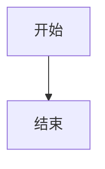

前置内容会被丢弃。

# 封面

副标题文字，包含 **粗体**、*斜体*、~~删除线~~、==高亮==、`行内代码`。

# 元素兼容性

## 列表

- 顶层
  - 子项

1. 第一项
2. 第二项

## 任务清单

- [ ] 未完成任务
- [x] 已完成任务

## 表格

| 列1 | 列2 |
| --- | --- |
| A   | B   |

## 数学

行内公式：$E=mc^2$

文本中的双 dollar：与 $$\mathrm{CuSO}_4$$ 反应。

文本中的结构公式：设 $$\begin{aligned}& 2\mathrm{NaOH}+\mathrm{CuSO}_4=\mathrm{Cu}(\mathrm{OH})_2\\& 80\quad160\end{aligned}$$ 后续文字。

$$a^2+b^2=c^2$$

$$
\begin{aligned}
f(x) &= x^2+1 \\
     &= (x+1)(x-1)+2
\end{aligned}
$$

```latex
$$x$$
```

$$\int_0^1 x^2 dx = \frac{1}{3}$$

## Mermaid



## Callout

> [!NOTE]
> 默认标题内容

> [!WARNING] 自定义警告
> 警告正文

> [!INVALID]
> 未知类型正文

## 图片

![[nested/path/photo one.png]]


## 代码

```python
def hello():
    print("hi")
```

```unknownlang
plain text
```
